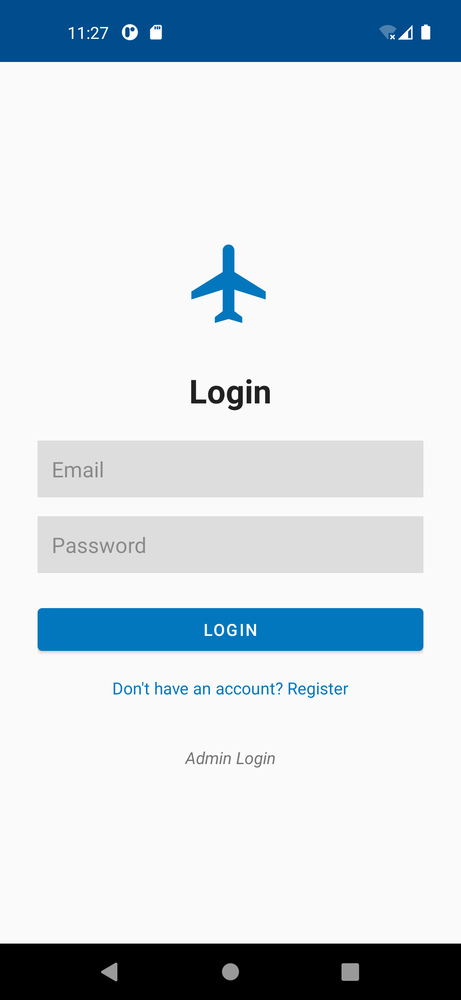
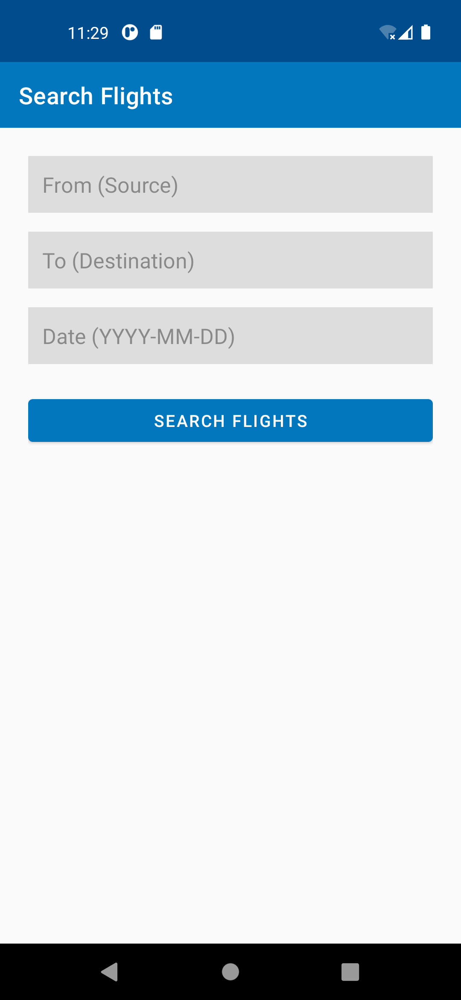
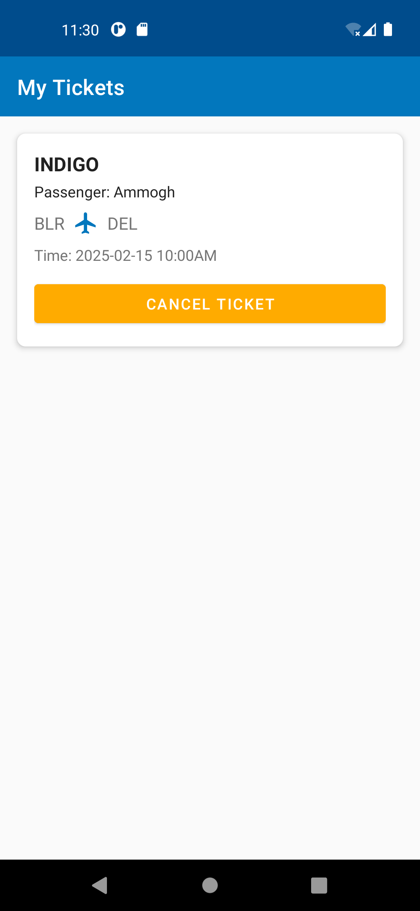
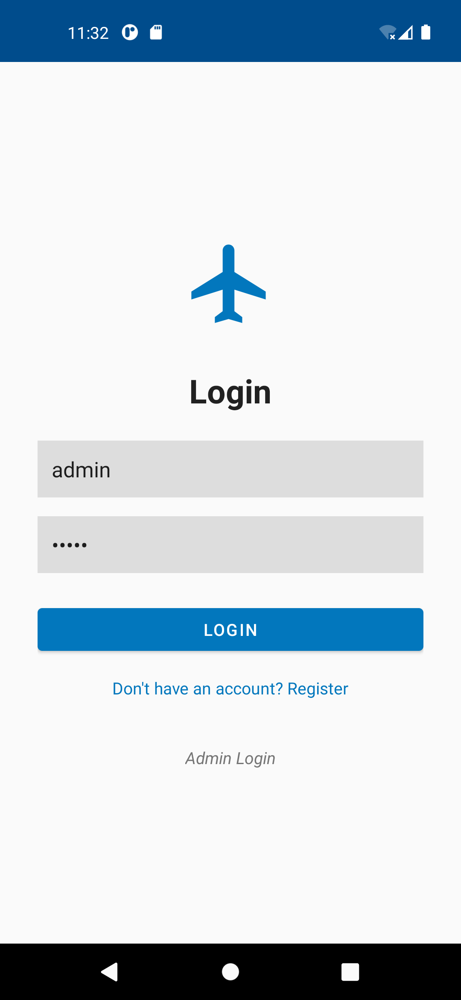
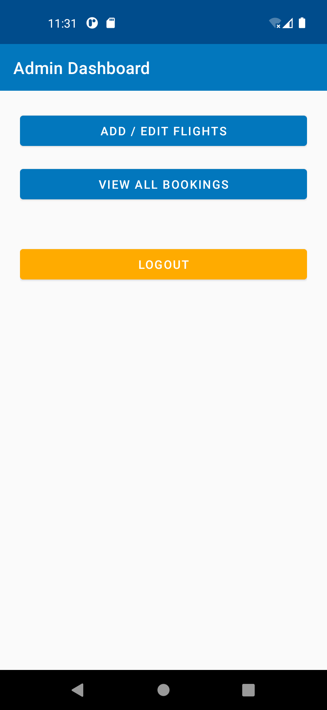
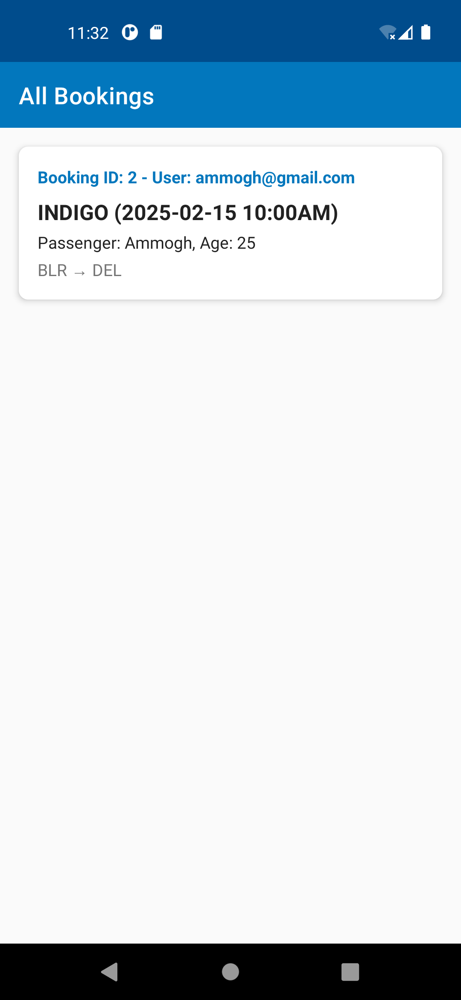

# Airline Reservation App ✈️

A comprehensive Android application built with Java that allows users to search and book flights, and provides an admin interface to manage the airline's operations.

## Screenshots 📸

| User Login | Flight Search | Blocked Tickets |
| :---: | :---: | :---: |
|  |  |  |

| Admin Login | Admin Dashboard | View Bookings |
| :---: | :---: | :---: |
|  |  |  |

## Features ✨

### For Users
*   **User Authentication**: Secure Registration and Login system.
*   **Flight Search**: Search for available flights by source, destination, and date.
*   **Flight Booking**: Easily book tickets for selected flights.
*   **My Tickets**: View a history of all currently booked tickets and flight details.

### For Administrators
*   **Admin Dashboard**: Dedicated portal for airline management.
*   **Flight Management**: Add new flights, edit existing schedules, and remove canceled flights.
*   **Booking Overview**: View all bookings made by all users across the platform.

## Technologies Used 🛠️

*   **Language**: Java
*   **UI/Layouts**: Android XML
*   **Local Database**: SQLite (`SQLiteOpenHelper`)
    *   *Tables*: `users`, `flights`, `bookings`
*   **Architecture**: Standard Android MVC (Activities, Models, Adapters, DatabaseHelper)

## App Structure 📂

*   **Activities**:
    *   `SplashActivity` - Welcome screen.
    *   `LoginActivity` & `RegisterActivity` - User/Admin authentication.
    *   `HomeActivity` - Main user dashboard.
    *   `FlightSearchActivity` & `FlightResultsActivity` - Searching and listing available routes.
    *   `BookingActivity` - Passenger details and ticket confirmation.
    *   `MyTicketsActivity` - User's booking history.
    *   `AdminDashboardActivity`, `AddEditFlightActivity`, `AdminViewBookingsActivity` - Admin operations.
*   **Models**: `User`, `Flight`, `Booking`
*   **Adapters**: `FlightAdapter`, `TicketAdapter`, `AdminBookingAdapter` for RecylerViews/ListViews.
*   **Database**: `DatabaseHelper` handles all CRUD operations and initial dummy data insertion.

## How to Run 🚀

1. Clone this repository to your local machine.
2. Open **Android Studio**.
3. Select **Open an existing Android Studio project** and navigate to the cloned directory.
4. Let Gradle sync and build the project dependencies.
5. Click the **Run** ▶️ button to launch the app on an Android Emulator or a connected physical device.

## Admin Access 🔑

To access the Admin Dashboard, use the following credentials on the Login screen:
*   **Email**: `admin`
*   **Password**: `admin`
*   **Note**: Enter the credentials and tap the **"Admin Login"** text button at the bottom of the screen instead of the main "Login" button.

---
*Developed as a complete Android learning project.*
